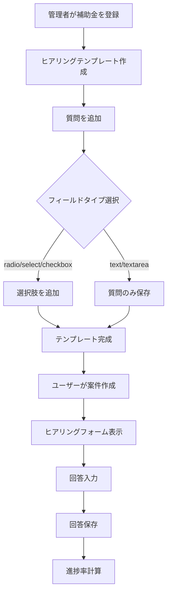

# ヒアリングテンプレートDB設計

## 概要

補助金申請時にユーザーが回答するヒアリングフォームのテンプレート機能を実装します。管理者が補助金ごとに質問を作成し、各質問にフィールドタイプと必須フラグを設定できるようにします。

## データベース設計

### テーブル構造

以下のテーブルをSQLマイグレーションファイルに追加します：

1. **profiles** - ユーザープロフィール（Supabaseのauth.usersと連携）
2. **cases** - 案件テーブル（補助金申請案件）
3. **hearing_templates** - ヒアリングテンプレート（補助金に1対1で紐づく）
4. **hearing_questions** - ヒアリング質問（テンプレートに紐づく）
5. **hearing_options** - 選択肢（radio/select/checkbox用）
6. **hearing_responses** - 回答セッション（案件に紐づく）
7. **hearing_response_values** - 回答値（各質問への回答）

### 詳細設計

#### 0-1. profiles テーブル

Supabaseの`auth.users`と連携するユーザープロフィールテーブルです。申請者、メンバー、専門家、アシスタントの4種類のユーザー種別を管理し、グループ機能を提供します。

```sql
-- ユーザープロフィールテーブル作成
DROP TABLE IF EXISTS profiles;
CREATE TABLE IF NOT EXISTS profiles (
  id UUID PRIMARY KEY, -- ユーザーID（Supabaseのauth.users.idと連携）
  email VARCHAR(255), -- メールアドレス（auth.usersから同期）
  full_name VARCHAR(255), -- 氏名
  company_name VARCHAR(500), -- 会社名
  phone VARCHAR(20) NOT NULL, -- 電話番号
  business_type VARCHAR(50) NOT NULL, -- 事業形態（株式会社、合同会社、個人事業主など）
  location VARCHAR(500) NOT NULL, -- 所在地
  industry VARCHAR(100) NOT NULL, -- 業種
  employees VARCHAR(50) NOT NULL, -- 従業員数（例：「1〜5名」「6〜10名」「11〜20名」など）
  user_type VARCHAR(20) NOT NULL, -- ユーザー種別（customer, member, expert, assistant）
  group_id UUID NOT NULL, -- グループID（customer/expertの場合は自分のid、member/assistantの場合は所属するcustomer/expertのid）
  created_at TIMESTAMPTZ NOT NULL DEFAULT NOW(), -- 作成日時
  updated_at TIMESTAMPTZ NOT NULL DEFAULT NOW(), -- 更新日時
  
  -- 外部キー制約（Supabaseのauth.usersと連携）
  CONSTRAINT fk_profiles_auth_user
    FOREIGN KEY (id)
    REFERENCES auth.users(id)
    ON DELETE CASCADE,
  
  -- ユーザー種別のチェック制約
  CONSTRAINT chk_profiles_user_type
    CHECK (user_type IN ('customer', 'member', 'expert', 'assistant','admin'))
);

-- カラムコメント追加（profiles）
COMMENT ON COLUMN profiles.id IS 'ユーザーID（Supabaseのauth.users.idと連携、主キー）';
COMMENT ON COLUMN profiles.email IS 'メールアドレス（auth.usersから同期）';
COMMENT ON COLUMN profiles.full_name IS '氏名';
COMMENT ON COLUMN profiles.company_name IS '会社名';
COMMENT ON COLUMN profiles.phone IS '電話番号';
COMMENT ON COLUMN profiles.business_type IS '事業形態（株式会社、合同会社、個人事業主など）';
COMMENT ON COLUMN profiles.location IS '所在地';
COMMENT ON COLUMN profiles.industry IS '業種';
COMMENT ON COLUMN profiles.employees IS '従業員数（文字列形式、例：「1〜5名」「6〜10名」「11〜20名」など）';
COMMENT ON COLUMN profiles.user_type IS 'ユーザー種別（customer: 申請者、member: 申請者のメンバー、expert: 専門家（行政書士）、assistant: 専門家のアシスタント）';
COMMENT ON COLUMN profiles.group_id IS 'グループID（customer/expertの場合は自分のid、member/assistantの場合は所属するcustomer/expertのid）';
```

#### 0-2. cases テーブル

補助金申請案件を管理するテーブルです。

```sql
-- 案件テーブル作成
CREATE TABLE IF NOT EXISTS cases (
  id BIGSERIAL PRIMARY KEY, -- 案件ID（主キー）
  subsidy_id BIGINT NOT NULL, -- 補助金ID（subsidiesへの外部キー）
  user_group_id UUID NOT NULL, -- 申請者グループID（profiles.group_idを指定。申請者がどのグループかを示す）
  expert_group_id UUID, -- 専門家グループID（profiles.group_idを指定。専門家がどのグループかを示す、オプション）
  hearing_template_id BIGINT, -- ヒアリングテンプレートID（hearing_templatesへの外部キー、オプション）
  task_group_id UUID, -- タスクグループID（profiles.group_idを指定。タスクを管理するグループ、オプション）
  created_at TIMESTAMPTZ NOT NULL DEFAULT NOW(), -- 作成日時
  updated_at TIMESTAMPTZ NOT NULL DEFAULT NOW(), -- 更新日時
  
  -- 外部キー制約
  CONSTRAINT fk_cases_subsidy
    FOREIGN KEY (subsidy_id)
    REFERENCES subsidies(id)
    ON DELETE RESTRICT,
  CONSTRAINT fk_cases_hearing_template
    FOREIGN KEY (hearing_template_id)
    REFERENCES hearing_templates(id)
    ON DELETE SET NULL
  
  -- 注意: user_group_id、expert_group_id、task_group_idはprofiles.group_idを指定するが、
  -- group_idは主キーではないため、外部キー制約は設定できない。
  -- アプリケーション層またはトリガーで整合性を保証する必要がある。
  -- title、deadline、amountはsubsidiesテーブルからJOINで取得可能
);

-- カラムコメント追加（cases）
COMMENT ON COLUMN cases.id IS '案件ID（主キー）';
COMMENT ON COLUMN cases.subsidy_id IS '補助金ID（subsidiesテーブルへの外部キー）';
COMMENT ON COLUMN cases.user_group_id IS '申請者グループID（profiles.group_idを指定。どの申請者グループがこの補助金を申し込みたいかを示す）';
COMMENT ON COLUMN cases.expert_group_id IS '専門家グループID（profiles.group_idを指定。どの専門家グループがこの案件を担当するかを示す。オプション）';
COMMENT ON COLUMN cases.hearing_template_id IS 'ヒアリングテンプレートID（hearing_templatesテーブルへの外部キー、オプション）';
COMMENT ON COLUMN cases.task_group_id IS 'タスクグループID（profiles.group_idを指定。タスクを管理するグループ、オプション）';
```

#### 1. hearing_templates テーブル

補助金ごとに1つのヒアリングテンプレートを作成します。

```sql
-- ヒアリングテンプレートテーブル作成
CREATE TABLE IF NOT EXISTS hearing_templates (
  id BIGSERIAL PRIMARY KEY, -- テンプレートID（主キー）
  subsidy_id BIGINT NOT NULL UNIQUE, -- 補助金ID（subsidiesへの外部キー、ユニーク制約）
  created_at TIMESTAMPTZ NOT NULL DEFAULT NOW(), -- 作成日時
  updated_at TIMESTAMPTZ NOT NULL DEFAULT NOW(), -- 更新日時
  
  -- 外部キー制約
  CONSTRAINT fk_hearing_templates_subsidy
    FOREIGN KEY (subsidy_id)
    REFERENCES subsidies(id)
    ON DELETE CASCADE
);

-- カラムコメント追加（hearing_templates）
COMMENT ON COLUMN hearing_templates.id IS 'テンプレートID（主キー）';
COMMENT ON COLUMN hearing_templates.subsidy_id IS '補助金ID（subsidiesテーブルへの外部キー、ユニーク制約あり）';
```

#### 2. hearing_questions テーブル

テンプレートに紐づく質問を保存します。フィールドタイプと必須フラグを設定できます。

```sql
-- ヒアリング質問テーブル作成
CREATE TABLE IF NOT EXISTS hearing_questions (
  id BIGSERIAL PRIMARY KEY, -- 質問ID（主キー）
  template_id BIGINT NOT NULL, -- テンプレートID（hearing_templatesへの外部キー）
  question_text TEXT NOT NULL, -- 質問文
  field_type VARCHAR(20) NOT NULL DEFAULT 'text', -- フィールドタイプ（'text', 'textarea', 'checkbox', 'radio', 'select'）
  is_required BOOLEAN NOT NULL DEFAULT FALSE, -- 必須フラグ
  display_order INTEGER NOT NULL DEFAULT 0, -- 表示順序
  placeholder VARCHAR(500), -- プレースホルダー（オプション）
  created_at TIMESTAMPTZ NOT NULL DEFAULT NOW(), -- 作成日時
  updated_at TIMESTAMPTZ NOT NULL DEFAULT NOW(), -- 更新日時
  
  -- 外部キー制約
  CONSTRAINT fk_hearing_questions_template
    FOREIGN KEY (template_id)
    REFERENCES hearing_templates(id)
    ON DELETE CASCADE,
  
  -- フィールドタイプのチェック制約
  CONSTRAINT chk_hearing_questions_field_type
    CHECK (field_type IN ('text', 'textarea', 'checkbox', 'radio', 'select'))
);

-- カラムコメント追加（hearing_questions）
COMMENT ON COLUMN hearing_questions.id IS '質問ID（主キー）';
COMMENT ON COLUMN hearing_questions.template_id IS 'テンプレートID（hearing_templatesテーブルへの外部キー）';
COMMENT ON COLUMN hearing_questions.question_text IS '質問文';
COMMENT ON COLUMN hearing_questions.field_type IS 'フィールドタイプ（text, textarea, checkbox, radio, selectのいずれか）';
COMMENT ON COLUMN hearing_questions.is_required IS '必須フラグ（true: 必須、false: 任意）';
COMMENT ON COLUMN hearing_questions.display_order IS '表示順序（小さい順に表示）';
COMMENT ON COLUMN hearing_questions.placeholder IS 'プレースホルダー（入力欄に表示するヒントテキスト、オプション）';
```

#### 3. hearing_options テーブル

radio/select/checkbox用の選択肢を保存します。

```sql
-- ヒアリング選択肢テーブル作成
CREATE TABLE IF NOT EXISTS hearing_options (
  id BIGSERIAL PRIMARY KEY, -- 選択肢ID（主キー）
  question_id BIGINT NOT NULL, -- 質問ID（hearing_questionsへの外部キー）
  option_text VARCHAR(500) NOT NULL, -- 選択肢テキスト
  display_order INTEGER NOT NULL DEFAULT 0, -- 表示順序
  created_at TIMESTAMPTZ NOT NULL DEFAULT NOW(), -- 作成日時
  
  -- 外部キー制約
  CONSTRAINT fk_hearing_options_question
    FOREIGN KEY (question_id)
    REFERENCES hearing_questions(id)
    ON DELETE CASCADE
);

-- カラムコメント追加（hearing_options）
COMMENT ON COLUMN hearing_options.id IS '選択肢ID（主キー）';
COMMENT ON COLUMN hearing_options.question_id IS '質問ID（hearing_questionsテーブルへの外部キー）';
COMMENT ON COLUMN hearing_options.option_text IS '選択肢テキスト';
COMMENT ON COLUMN hearing_options.display_order IS '表示順序（小さい順に表示）';
```

#### 4. hearing_responses テーブル

ユーザーが案件に対して回答したセッションを保存します。進捗率はNext.jsの画面側で計算するため、DBには保存しません。

```sql
-- ヒアリング回答テーブル作成
CREATE TABLE IF NOT EXISTS hearing_responses (
  id BIGSERIAL PRIMARY KEY, -- 回答ID（主キー）
  case_id BIGINT NOT NULL, -- 案件ID（casesテーブルへの外部キー）
  template_id BIGINT NOT NULL, -- テンプレートID（hearing_templatesへの外部キー）
  status VARCHAR(20) NOT NULL DEFAULT 'draft', -- ステータス（'draft', 'submitted'）
  created_at TIMESTAMPTZ NOT NULL DEFAULT NOW(), -- 作成日時
  updated_at TIMESTAMPTZ NOT NULL DEFAULT NOW(), -- 更新日時
  submitted_at TIMESTAMPTZ, -- 提出日時（オプション）
  
  -- 外部キー制約
  CONSTRAINT fk_hearing_responses_case
    FOREIGN KEY (case_id)
    REFERENCES cases(id)
    ON DELETE CASCADE,
  CONSTRAINT fk_hearing_responses_template
    FOREIGN KEY (template_id)
    REFERENCES hearing_templates(id)
    ON DELETE RESTRICT,
  
  -- ステータスのチェック制約
  CONSTRAINT chk_hearing_responses_status
    CHECK (status IN ('draft', 'submitted'))
);

-- カラムコメント追加（hearing_responses）
COMMENT ON COLUMN hearing_responses.id IS '回答ID（主キー）';
COMMENT ON COLUMN hearing_responses.case_id IS '案件ID（casesテーブルへの外部キー）';
COMMENT ON COLUMN hearing_responses.template_id IS 'テンプレートID（hearing_templatesテーブルへの外部キー）';
COMMENT ON COLUMN hearing_responses.status IS 'ステータス（draft: 下書き、submitted: 提出済み）';
COMMENT ON COLUMN hearing_responses.submitted_at IS '提出日時（提出時に設定、オプション）';
```

#### 5. hearing_response_values テーブル

各質問への具体的な回答を保存します。checkboxの場合は複数レコードが作成されます。

```sql
-- ヒアリング回答値テーブル作成
CREATE TABLE IF NOT EXISTS hearing_response_values (
  id BIGSERIAL PRIMARY KEY, -- 回答値ID（主キー）
  response_id BIGINT NOT NULL, -- 回答ID（hearing_responsesへの外部キー）
  question_id BIGINT NOT NULL, -- 質問ID（hearing_questionsへの外部キー）
  value_text TEXT, -- 回答テキスト（text/textarea用）
  option_id BIGINT, -- 選択肢ID（radio/select/checkbox用、hearing_optionsへの外部キー）
  created_at TIMESTAMPTZ NOT NULL DEFAULT NOW(), -- 作成日時
  updated_at TIMESTAMPTZ NOT NULL DEFAULT NOW(), -- 更新日時
  
  -- 外部キー制約
  CONSTRAINT fk_hearing_response_values_response
    FOREIGN KEY (response_id)
    REFERENCES hearing_responses(id)
    ON DELETE CASCADE,
  CONSTRAINT fk_hearing_response_values_question
    FOREIGN KEY (question_id)
    REFERENCES hearing_questions(id)
    ON DELETE RESTRICT,
  CONSTRAINT fk_hearing_response_values_option
    FOREIGN KEY (option_id)
    REFERENCES hearing_options(id)
    ON DELETE SET NULL,
  
  -- value_textとoption_idのいずれか一方は必須
  CONSTRAINT chk_hearing_response_values_value
    CHECK ((value_text IS NOT NULL) OR (option_id IS NOT NULL))
);

-- カラムコメント追加（hearing_response_values）
COMMENT ON COLUMN hearing_response_values.id IS '回答値ID（主キー）';
COMMENT ON COLUMN hearing_response_values.response_id IS '回答ID（hearing_responsesテーブルへの外部キー）';
COMMENT ON COLUMN hearing_response_values.question_id IS '質問ID（hearing_questionsテーブルへの外部キー）';
COMMENT ON COLUMN hearing_response_values.value_text IS '回答テキスト（text/textareaタイプの質問への回答）';
COMMENT ON COLUMN hearing_response_values.option_id IS '選択肢ID（radio/select/checkboxタイプの質問への回答、hearing_optionsテーブルへの外部キー）';
```

### インデックスとトリガー

```sql
-- インデックス作成（profiles）
CREATE INDEX IF NOT EXISTS idx_profiles_email ON profiles(email);
CREATE INDEX IF NOT EXISTS idx_profiles_user_type ON profiles(user_type);
CREATE INDEX IF NOT EXISTS idx_profiles_group_id ON profiles(group_id);

-- インデックス作成（cases）
CREATE INDEX IF NOT EXISTS idx_cases_subsidy_id ON cases(subsidy_id);
CREATE INDEX IF NOT EXISTS idx_cases_user_group_id ON cases(user_group_id);
CREATE INDEX IF NOT EXISTS idx_cases_expert_group_id ON cases(expert_group_id);
CREATE INDEX IF NOT EXISTS idx_cases_task_group_id ON cases(task_group_id);
CREATE INDEX IF NOT EXISTS idx_cases_hearing_template_id ON cases(hearing_template_id);

-- インデックス作成（hearing_templates）
CREATE INDEX IF NOT EXISTS idx_hearing_templates_subsidy_id ON hearing_templates(subsidy_id);
CREATE INDEX IF NOT EXISTS idx_hearing_questions_template_id ON hearing_questions(template_id);
CREATE INDEX IF NOT EXISTS idx_hearing_questions_display_order ON hearing_questions(template_id, display_order);
CREATE INDEX IF NOT EXISTS idx_hearing_options_question_id ON hearing_options(question_id);
CREATE INDEX IF NOT EXISTS idx_hearing_options_display_order ON hearing_options(question_id, display_order);
CREATE INDEX IF NOT EXISTS idx_hearing_responses_case_id ON hearing_responses(case_id);
CREATE INDEX IF NOT EXISTS idx_hearing_responses_template_id ON hearing_responses(template_id);
CREATE INDEX IF NOT EXISTS idx_hearing_responses_status ON hearing_responses(status);
CREATE INDEX IF NOT EXISTS idx_hearing_responses_case_template ON hearing_responses(case_id, template_id);
CREATE INDEX IF NOT EXISTS idx_hearing_response_values_response_id ON hearing_response_values(response_id);
CREATE INDEX IF NOT EXISTS idx_hearing_response_values_question_id ON hearing_response_values(question_id);
CREATE INDEX IF NOT EXISTS idx_hearing_response_values_option_id ON hearing_response_values(option_id);

-- updated_atを自動更新するトリガー関数（profiles）
CREATE OR REPLACE FUNCTION update_profiles_updated_at()
RETURNS TRIGGER AS $$
BEGIN
  NEW.updated_at = NOW();
  RETURN NEW;
END;
$$ LANGUAGE plpgsql;

-- updated_atを自動更新するトリガー関数（cases）
CREATE OR REPLACE FUNCTION update_cases_updated_at()
RETURNS TRIGGER AS $$
BEGIN
  NEW.updated_at = NOW();
  RETURN NEW;
END;
$$ LANGUAGE plpgsql;

-- updated_atを自動更新するトリガー関数（hearing_templates）
CREATE OR REPLACE FUNCTION update_hearing_templates_updated_at()
RETURNS TRIGGER AS $$
BEGIN
  NEW.updated_at = NOW();
  RETURN NEW;
END;
$$ LANGUAGE plpgsql;

CREATE OR REPLACE FUNCTION update_hearing_questions_updated_at()
RETURNS TRIGGER AS $$
BEGIN
  NEW.updated_at = NOW();
  RETURN NEW;
END;
$$ LANGUAGE plpgsql;

CREATE OR REPLACE FUNCTION update_hearing_responses_updated_at()
RETURNS TRIGGER AS $$
BEGIN
  NEW.updated_at = NOW();
  RETURN NEW;
END;
$$ LANGUAGE plpgsql;

CREATE OR REPLACE FUNCTION update_hearing_response_values_updated_at()
RETURNS TRIGGER AS $$
BEGIN
  NEW.updated_at = NOW();
  RETURN NEW;
END;
$$ LANGUAGE plpgsql;

-- auth.usersにユーザーが作成されたときにprofilesテーブルにレコードを自動作成するトリガー関数
CREATE OR REPLACE FUNCTION handle_new_user()
RETURNS TRIGGER
SECURITY DEFINER
SET search_path = public
LANGUAGE plpgsql
AS $$
DECLARE
  user_meta JSONB;
  table_exists BOOLEAN;
BEGIN
  -- profilesテーブルの存在確認
  SELECT EXISTS (
    SELECT FROM information_schema.tables 
    WHERE table_schema = 'public' 
    AND table_name = 'profiles'
  ) INTO table_exists;
  
  -- テーブルが存在しない場合は何もしない
  IF NOT table_exists THEN
    RETURN NEW;
  END IF;
  
  -- raw_user_meta_dataからメタデータを取得
  user_meta := COALESCE(NEW.raw_user_meta_data, '{}'::jsonb);
  
  -- profilesテーブルにレコードを挿入（register/page.tsxでは常にcustomerとして登録）
  BEGIN
    INSERT INTO public.profiles (
      id,
      email,
      full_name,
      company_name,
      phone,
      business_type,
      location,
      industry,
      employees,
      user_type,
      group_id
    ) VALUES (
      NEW.id,
      NEW.email,
      NULLIF(user_meta->>'name', ''),
      NULLIF(user_meta->>'companyName', ''),
      NULLIF(user_meta->>'phone', ''),
      NULLIF(user_meta->>'businessType', ''),
      NULLIF(user_meta->>'location', ''),
      NULLIF(user_meta->>'industry', ''),
      NULLIF(user_meta->>'employees', ''),
      COALESCE(NULLIF(user_meta->>'userType', ''), 'customer'), -- user_metaから取得。なければ'customer'
      NEW.id -- group_idは自分のidと同じ（customerの場合）
    )
    ON CONFLICT (id) DO NOTHING; -- 既に存在する場合は何もしない
  EXCEPTION
    WHEN OTHERS THEN
      -- エラーが発生した場合でもユーザー作成は続行させる
      -- エラーログを出力（Supabaseのログで確認可能）
      RAISE WARNING 'Error creating profile for user %: %', NEW.id, SQLERRM;
      -- エラーを再発生させない（ユーザー作成を継続）
  END;
  
  RETURN NEW;
EXCEPTION
  WHEN OTHERS THEN
    -- 最上位の例外ハンドリング：エラーを完全に抑制してユーザー作成を継続
    RAISE WARNING 'Critical error in handle_new_user for user %: %', NEW.id, SQLERRM;
    RETURN NEW;
END;
$$;

-- 関数の所有者をpostgresに設定（権限問題を回避）
ALTER FUNCTION handle_new_user() OWNER TO postgres;

-- 関数の実行権限を付与
GRANT EXECUTE ON FUNCTION handle_new_user() TO postgres;
GRANT EXECUTE ON FUNCTION handle_new_user() TO supabase_auth_admin;

-- profilesテーブルへのINSERT権限を付与（認証システムがINSERTできるように）
GRANT INSERT ON public.profiles TO postgres;
GRANT INSERT ON public.profiles TO supabase_auth_admin;
GRANT INSERT ON public.profiles TO authenticated;
GRANT INSERT ON public.profiles TO service_role;

-- auth.usersにINSERTが発生したときに実行されるトリガー
DROP TRIGGER IF EXISTS on_auth_user_created ON auth.users;
CREATE TRIGGER on_auth_user_created
  AFTER INSERT ON auth.users
  FOR EACH ROW
  EXECUTE FUNCTION handle_new_user();

-- トリガー作成（profiles）
DROP TRIGGER IF EXISTS update_profiles_updated_at ON profiles;
CREATE TRIGGER update_profiles_updated_at
  BEFORE UPDATE ON profiles
  FOR EACH ROW
  EXECUTE FUNCTION update_profiles_updated_at();

-- トリガー作成（cases）
DROP TRIGGER IF EXISTS update_cases_updated_at ON cases;
CREATE TRIGGER update_cases_updated_at
  BEFORE UPDATE ON cases
  FOR EACH ROW
  EXECUTE FUNCTION update_cases_updated_at();

-- トリガー作成（hearing_templates）
DROP TRIGGER IF EXISTS update_hearing_templates_updated_at ON hearing_templates;
CREATE TRIGGER update_hearing_templates_updated_at
  BEFORE UPDATE ON hearing_templates
  FOR EACH ROW
  EXECUTE FUNCTION update_hearing_templates_updated_at();

DROP TRIGGER IF EXISTS update_hearing_questions_updated_at ON hearing_questions;
CREATE TRIGGER update_hearing_questions_updated_at
  BEFORE UPDATE ON hearing_questions
  FOR EACH ROW
  EXECUTE FUNCTION update_hearing_questions_updated_at();

DROP TRIGGER IF EXISTS update_hearing_responses_updated_at ON hearing_responses;
CREATE TRIGGER update_hearing_responses_updated_at
  BEFORE UPDATE ON hearing_responses
  FOR EACH ROW
  EXECUTE FUNCTION update_hearing_responses_updated_at();

DROP TRIGGER IF EXISTS update_hearing_response_values_updated_at ON hearing_response_values;
CREATE TRIGGER update_hearing_response_values_updated_at
  BEFORE UPDATE ON hearing_response_values
  FOR EACH ROW
  EXECUTE FUNCTION update_hearing_response_values_updated_at();

-- テーブルコメント追加
COMMENT ON TABLE profiles IS 'ユーザープロフィールテーブル。Supabaseのauth.usersと連携して追加のプロフィール情報を保存';
COMMENT ON TABLE cases IS '案件テーブル。補助金申請案件を管理';
COMMENT ON TABLE hearing_templates IS 'ヒアリングテンプレートテーブル。補助金ごとに1つのテンプレートを作成';
COMMENT ON TABLE hearing_questions IS 'ヒアリング質問テーブル。テンプレートに紐づく質問を保存';
COMMENT ON TABLE hearing_options IS 'ヒアリング選択肢テーブル。radio/select/checkbox用の選択肢を保存';
COMMENT ON TABLE hearing_responses IS 'ヒアリング回答テーブル。ユーザーが案件に対して回答したセッションを保存';
COMMENT ON TABLE hearing_response_values IS 'ヒアリング回答値テーブル。各質問への具体的な回答を保存';

-- RLS（Row Level Security）無効化（一旦すべてのアクセスを許可）
-- 後で必要に応じてRLSを有効化し、ポリシーを追加可能
ALTER TABLE profiles DISABLE ROW LEVEL SECURITY;
ALTER TABLE cases DISABLE ROW LEVEL SECURITY;
ALTER TABLE hearing_responses DISABLE ROW LEVEL SECURITY;
ALTER TABLE hearing_response_values DISABLE ROW LEVEL SECURITY;
```

## 実装ファイル

- `prisma/migrations/create_hearing_templates.sql` - ヒアリングテンプレート関連テーブルの作成SQL

## データフロー



## 注意事項

- `subsidies`テーブルは既存の`create_subsidies_tables.sql`で定義済み
- `profiles`テーブルはSupabaseの`auth.users`と連携するため、`auth.users`のスキーマに依存
- `profiles`テーブルのユーザー種別：
  - `customer`: 申請者（案件を作成・進めることができる。グループのオーナー）
  - `member`: 申請者のメンバー（customerと同じ処理が可能。customerが複数メンバーを追加できる。申請者が進めている案件の代理ができる）
  - `expert`: 専門家（行政書士。グループのオーナー）
  - `assistant`: 専門家のアシスタント（expertと同じ役割。ある行政書士のアシスタントの役割は同じ）
- `group_id`はグループを識別するために使用（customer/expertの場合は自分のid、member/assistantの場合は所属するcustomer/expertのid）
- グループオーナーの種別チェック（customer/expertのみがオーナーになれる）はアプリケーション層またはトリガーで実装する必要がある
- `cases`テーブルは`subsidies`に外部キー制約を持つ
- `cases.user_group_id`、`cases.expert_group_id`、`cases.task_group_id`は`profiles.group_id`を指定するが、`group_id`は主キーではないため外部キー制約は設定できない。アプリケーション層またはトリガーで整合性を保証する必要がある
- `cases.user_group_id`は申請者グループを指定（どの申請者グループがこの補助金を申し込みたいか）
- `cases.expert_group_id`は専門家グループを指定（どの専門家グループがこの案件を担当するか、オプション）
- `cases.task_group_id`はタスクグループを指定（タスクを管理するグループ、オプション）
- `cases.hearing_template_id`はヒアリングテンプレートへの外部キー（オプション）
- `hearing_responses`の`case_id`は`cases`テーブルへの外部キー制約を持つ
- フィールドタイプのバリデーションはアプリケーション層でも実装が必要
- checkboxの場合は`hearing_response_values`に複数レコードが作成される
- 進捗率はNext.jsの画面側で必須項目の回答状況から計算するため、DBには保存しない
- `hearing_response_values`では`value_text`と`option_id`のいずれか一方が必須
- `profiles`テーブルの`id`はUUID型で、Supabaseの`auth.users.id`と一致させる必要がある
- `auth.users`にユーザーが作成されたときに自動的に`profiles`テーブルにレコードを作成するトリガー（`handle_new_user`）を設定
- **重要**: トリガーを作成する前に、必ず`profiles`テーブルを作成しておく必要がある。テーブルが存在しない場合、ユーザー登録時にエラーが発生する
- トリガー関数は`raw_user_meta_data`から`name`, `companyName`, `phone`, `businessType`, `location`, `industry`, `employees`を取得して`profiles`に挿入
- `register/page.tsx`では常に`customer`として登録されるため、`user_type`は常に`'customer'`に設定される
- `group_id`は自分の`id`と同じになる（customerの場合）
- トリガー関数は`SECURITY DEFINER`で実行されるため、適切な権限が必要。Supabaseの`auth`スキーマに対する操作権限が必要な場合がある
- エラーが発生した場合でもユーザー作成は続行されるように`EXCEPTION`ハンドリングを実装済み
- RLS（Row Level Security）は一旦無効化されている（すべてのアクセスを許可）
- 後で必要に応じてRLSを有効化し、適切なポリシーを追加可能
- INSERT操作に対してはRLSポリシーは不要（アプリケーション層で制御）

## 次のステップ

1. SQLマイグレーションファイルを作成
2. データベースにマイグレーションを実行
3. フロントエンドの型定義を更新（`app/admin/management/types.ts`など）
4. 管理者画面のヒアリングテンプレート作成UIを拡張
5. ユーザー側のヒアリングフォームを動的生成に変更